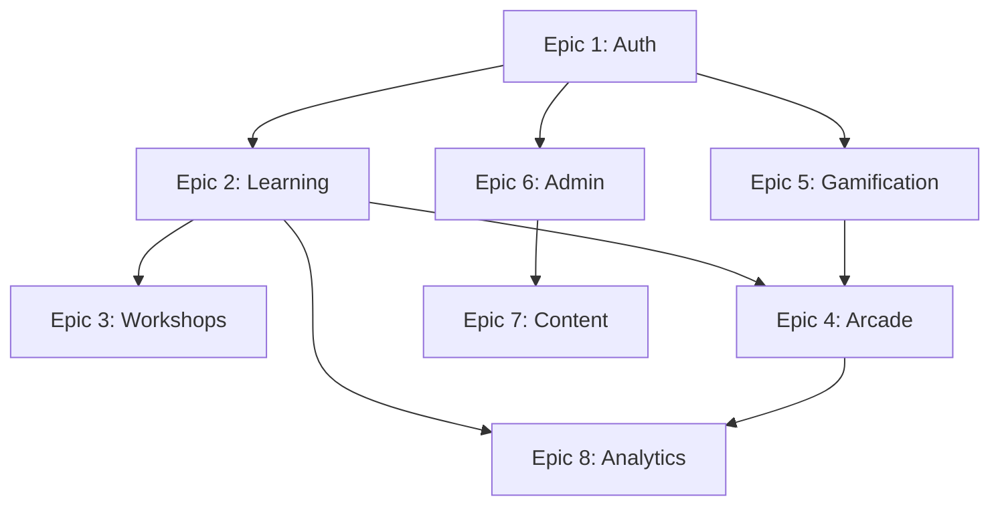

# BİLSEMC2 Platform - Epic Breakdown

## Overview

Bu doküman, BİLSEMC2 üstün yetenekli çocuklar eğitim platformunun tüm Epic ve Story dağılımını içermektedir. Platform, BİLSEM sınavlarına hazırlık, kognitif gelişim ve yetenek değerlendirme alanlarında kapsamlı dijital çözümler sunmaktadır.

## Requirements Inventory

### Functional Requirements

| FR ID | Requirement | Priority |
|-------|-------------|----------|
| FR-001 | Kullanıcı kimlik doğrulama ve yetkilendirme | Critical |
| FR-002 | BİLSEM sınav hazırlık quiz sistemi | Critical |
| FR-003 | Bireysel değerlendirme simülatörleri | High |
| FR-004 | Müzik yetenek değerlendirme modülü | High |
| FR-005 | Resim yetenek değerlendirme modülü | High |
| FR-006 | BİLSEM Zeka oyun merkezi | High |
| FR-007 | XP ve ödül sistemi | Medium |
| FR-008 | Admin panel ve kullanıcı yönetimi | Critical |
| FR-009 | Blog ve içerik yönetimi | Medium |
| FR-010 | SEO ve AI crawler optimizasyonu | Medium |
| FR-011 | Paket ve abonelik yönetimi | High |
| FR-012 | Öğrenci performans takibi | High |

### NonFunctional Requirements

| NFR ID | Requirement | Priority |
|--------|-------------|----------|
| NFR-001 | Sayfa yüklenme süresi < 3 saniye | High |
| NFR-002 | %99.9 uptime garantisi | Critical |
| NFR-003 | KVKK ve GDPR uyumluluğu | Critical |
| NFR-004 | Mobile-first responsive tasarım | High |
| NFR-005 | Türkçe karakter desteği (UTF-8) | Critical |

### FR Coverage Map

| Epic | Covered FRs |
|------|-------------|
| Epic 1: Auth & Identity | FR-001 |
| Epic 2: Core Learning | FR-002, FR-003 |
| Epic 3: Talent Workshops | FR-004, FR-005 |
| Epic 4: BİLSEM Zeka | FR-006 |
| Epic 5: Gamification | FR-007 |
| Epic 6: Admin Infrastructure | FR-008, FR-011, FR-012 |
| Epic 7: Content & SEO | FR-009, FR-010 |

## Epic List

1. **Epic 1: Authentication & Identity Management** - Kullanıcı kimlik yönetimi
2. **Epic 2: Core Learning Platform** - Temel öğrenme altyapısı
3. **Epic 3: Talent Workshops** - Müzik ve Resim atölyeleri
4. **Epic 4: BİLSEM Zeka Arcade** - Premium oyun merkezi
5. **Epic 5: Gamification & XP Economy** - Oyunlaştırma sistemi
6. **Epic 6: Admin Infrastructure** - Yönetim paneli
7. **Epic 7: Content & SEO Management** - İçerik ve SEO yönetimi
8. **Epic 8: Performance & Analytics** - Performans takibi

---

## Epic 1: Authentication & Identity Management

**Goal:** Güvenli ve kullanıcı dostu kimlik doğrulama sistemi sağlamak.

### Story 1.1: User Registration Flow

As a **yeni kullanıcı**,
I want **e-posta ile kayıt olabilmek**,
So that **platforma erişim sağlayabileyim**.

**Acceptance Criteria:**

**Given** kullanıcı kayıt sayfasında
**When** geçerli e-posta ve şifre girdiğinde
**Then** hesap oluşturulmalı ve doğrulama e-postası gönderilmeli
**And** profil sayfasına yönlendirilmeli

### Story 1.2: Student Access Code System

As a **öğretmen**,
I want **öğrencilerim için erişim kodları oluşturabilmek**,
So that **öğrenciler e-posta olmadan platforma erişebilsin**.

**Acceptance Criteria:**

**Given** öğretmen panelinde
**When** yeni erişim kodu oluşturduğunda
**Then** 6 haneli benzersiz kod üretilmeli
**And** öğrenci bu kodla giriş yapabilmeli

### Story 1.3: Admin Password Reset

As a **admin kullanıcı**,
I want **öğrenci şifrelerini sıfırlayabilmek**,
So that **unutulan şifreleri kurtarabileyim**.

**Acceptance Criteria:**

**Given** admin panelindeki kullanıcı yönetimi sayfasında
**When** bir kullanıcı için şifre sıfırla butonuna tıkladığımda
**Then** yeni şifre oluşturulmalı ve güvenli şekilde iletilmeli

---

## Epic 2: Core Learning Platform

**Goal:** BİLSEM sınav hazırlığı için kapsamlı öğrenme platformu sunmak.

### Story 2.1: Quiz System Foundation

As a **öğrenci**,
I want **TÜZÖ formatında quiz çözebilmek**,
So that **BİLSEM sınavına hazırlanabileyim**.

**Acceptance Criteria:**

**Given** quiz sayfasında
**When** bir quiz seçtiğimde
**Then** sorular sırayla gösterilmeli
**And** süre takibi yapılmalı
**And** sonuçlar kaydedilmeli

### Story 2.2: Individual Assessment Simulators

As a **2. aşama adayı**,
I want **bireysel değerlendirme simülatörlerini kullanabilmek**,
So that **gerçek sınav formatına alışabileyim**.

**Acceptance Criteria:**

**Given** bireysel değerlendirme sayfasında
**When** bir simülatör seçtiğimde
**Then** interaktif egzersiz başlamalı
**And** performans analizi gösterilmeli

### Story 2.3: Cognitive Training Games

As a **öğrenci**,
I want **kognitif eğitim oyunları oynayabilmek**,
So that **zeka yeteneklerimi geliştirebilleyim**.

**Acceptance Criteria:**

**Given** oyunlar sayfasında
**When** bir oyun seçtiğimde
**Then** oyun yüklenmeli ve başlamalı
**And** skor kaydedilmeli

---

## Epic 3: Talent Workshops

**Goal:** Müzik ve resim yetenek değerlendirmesi için AI destekli atölyeler sunmak.

### Story 3.1: Music Workshop - Rhythm Analysis

As a **müzik yeteneği adayı**,
I want **ritim algılama testleri yapabilmek**,
So that **ritim yeteneğimi ölçebilleyim**.

**Acceptance Criteria:**

**Given** müzik atölyesi sayfasında
**When** ritim testi başlattığımda
**Then** sesli ritim patternleri çalınmalı
**And** tepki süresi ve doğruluk ölçülmeli

### Story 3.2: Music Workshop - Melody Memory

As a **müzik yeteneği adayı**,
I want **melodi hafızası testleri yapabilmek**,
So that **müzikal hafızamı geliştirebilleyim**.

**Acceptance Criteria:**

**Given** melodi testi sayfasında
**When** test başladığında
**Then** melodi çalınmalı ve tekrar etmem istenmeli
**And** doğruluk oranı hesaplanmalı

### Story 3.3: Art Workshop - AI Drawing Analysis

As a **resim yeteneği adayı**,
I want **çizimlerimi AI ile analiz ettirebilmek**,
So that **resim yeteneklerimi değerlendirebilleyim**.

**Acceptance Criteria:**

**Given** resim atölyesi sayfasında
**When** bir çizim yüklediğimde
**Then** AI analizi yapılmalı
**And** kompozisyon, teknik ve yaratıcılık puanları gösterilmeli

### Story 3.4: Art Workshop - Story Completion

As a **resim yeteneği adayı**,
I want **hikaye tamamlama egzersizleri yapabilmek**,
So that **yaratıcı düşünme yeteneğimi geliştirebilleyim**.

**Acceptance Criteria:**

**Given** hikaye tamamlama sayfasında
**When** bir hikaye başlangıcı gösterildiğinde
**Then** çizim yapabilmeli ve hikayeyi tamamlayabilmeliyim
**And** AI değerlendirmesi alabilmeliyim

---

## Epic 4: BİLSEM Zeka Arcade

**Goal:** Premium beyin eğitimi oyunları sunan arcade merkezi oluşturmak.

### Story 4.1: Arcade Hub Interface

As a **öğrenci**,
I want **tüm arcade oyunlarını tek sayfada görebilmek**,
So that **istediğim oyunu kolayca seçebilleyim**.

**Acceptance Criteria:**

**Given** BİLSEM Zeka sayfasında
**When** sayfa yüklendiğinde
**Then** tüm oyunlar kartlar halinde gösterilmeli
**And** XP gereksinimleri ve kategoriler görünmeli

### Story 4.2: XP-Gated Game Access

As a **öğrenci**,
I want **XP harcayarak premium oyunlara erişebilmek**,
So that **kazandığım XP'leri kullanabileyim**.

**Acceptance Criteria:**

**Given** bir arcade oyunu seçtiğimde
**When** yeterli XP'im varsa
**Then** XP düşülmeli ve oyun başlamalı
**And** yetersiz XP'de uyarı gösterilmeli

### Story 4.3: Individual Game Implementation

As a **öğrenci**,
I want **çeşitli beyin eğitimi oyunları oynayabilmek**,
So that **farklı kognitif yeteneklerimi geliştirebilleyim**.

**Oyun Listesi:**
- Cam Köprü (Spatial Reasoning)
- ChromaBreak (Color Logic)
- Karanlık Labirent (Memory)
- Kart Dedektifi (Pattern Recognition)
- Küp Puzzle (3D Thinking)
- Neşeli Balonlar (Math)
- Ayna (Visual Processing)
- Bubble Numbers (Arithmetic)
- Kraft Origami (Spatial)
- Dark Maze (Navigation)

---

## Epic 5: Gamification & XP Economy

**Goal:** Öğrenci motivasyonunu artıran oyunlaştırma sistemi kurmak.

### Story 5.1: XP Earning System

As a **öğrenci**,
I want **aktivitelerden XP kazanabilmek**,
So that **ilerlememi takip edebilleyim**.

**Acceptance Criteria:**

**Given** bir quiz veya oyun tamamladığımda
**When** başarılı olduğumda
**Then** XP kazanmalı ve bakiyem güncellenmeli

### Story 5.2: XP Requirements Management

As a **admin**,
I want **sayfa ve oyun bazında XP gereksinimleri belirleyebilmek**,
So that **premium içeriklere erişimi kontrol edebilleyim**.

**Acceptance Criteria:**

**Given** admin panelinde XP yönetimi sayfasında
**When** bir sayfa için XP gereksinimi belirlediğimde
**Then** o sayfaya erişim XP kontrolüne tabi olmalı

---

## Epic 6: Admin Infrastructure

**Goal:** Kapsamlı yönetim paneli ve kullanıcı yönetimi sağlamak.

### Story 6.1: User Management Dashboard

As a **admin**,
I want **tüm kullanıcıları yönetebilmek**,
So that **hesapları kontrol edebilleyim**.

**Acceptance Criteria:**

**Given** admin panelinde
**When** kullanıcı yönetimi sayfasını açtığımda
**Then** kullanıcı listesi, filtreleme ve arama özellikleri olmalı

### Story 6.2: Package & Subscription Management

As a **admin**,
I want **paket ve abonelik yönetimi yapabilmek**,
So that **kullanıcı erişimlerini kontrol edebilleyim**.

**Acceptance Criteria:**

**Given** admin panelinde paket yönetimi sayfasında
**When** yeni paket oluşturduğumda
**Then** paket özellikleri ve fiyatlandırma tanımlanabilmeli

### Story 6.3: Student Analytics Dashboard

As a **admin/öğretmen**,
I want **öğrenci performans analizlerini görebilmek**,
So that **ilerlemeyi takip edebilleyim**.

**Acceptance Criteria:**

**Given** analitik dashboard'unda
**When** bir öğrenci seçtiğimde
**Then** quiz sonuçları, oyun performansı ve zaman bazlı grafikler gösterilmeli

---

## Epic 7: Content & SEO Management

**Goal:** Blog içerik yönetimi ve SEO optimizasyonu sağlamak.

### Story 7.1: Blog Management System

As a **admin**,
I want **blog yazıları oluşturabilmek ve yönetebilmek**,
So that **platform içeriğini zenginleştirebilleyim**.

**Acceptance Criteria:**

**Given** blog yönetimi sayfasında
**When** yeni blog yazısı oluşturduğumda
**Then** başlık, içerik, görsel ve meta bilgileri girebilmeliyim
**And** doğru Türkçe slug otomatik oluşturulmalı

### Story 7.2: AI Blog Writer Integration

As a **admin**,
I want **AI ile blog taslakları oluşturabilmek**,
So that **içerik üretimini hızlandırabileyim**.

**Acceptance Criteria:**

**Given** blog yönetimi sayfasında
**When** AI yazarı tetiklediğimde
**Then** konu bazlı taslak oluşturulmalı
**And** düzenleyip yayınlayabilmeliyim

### Story 7.3: SEO & AI Crawler Optimization

As a **platform**,
I want **AI sistemleri tarafından indekslenebilmek**,
So that **ChatGPT, Claude gibi sistemlerde görünebilleyim**.

**Acceptance Criteria:**

**Given** site deploy edildiğinde
**When** AI crawlerlar ziyaret ettiğinde
**Then** robots.txt izin vermeli
**And** llms.txt platform bilgilerini sunmalı
**And** sitemap.xml tüm URL'leri içermeli

### Story 7.4: Turkish Character Slug Generation

As a **sistem**,
I want **Türkçe karakterleri doğru slug'a dönüştürebilmek**,
So that **SEO-uyumlu URL'ler oluşturabileyim**.

**Acceptance Criteria:**

**Given** Türkçe başlıklı içerik oluşturulduğunda
**When** slug üretildiğinde
**Then** İ→i, Ğ→g, Ü→u, Ş→s, Ö→o, Ç→c dönüşümü yapılmalı
**And** hem frontend hem backend tutarlı olmalı

---

## Epic 8: Performance & Analytics

**Goal:** Platform performansını izlemek ve raporlamak.

### Story 8.1: Student Performance Tracking

As a **öğretmen/veli**,
I want **öğrenci performansını takip edebilmek**,
So that **gelişimi izleyebilleyim**.

**Acceptance Criteria:**

**Given** öğrenci profil sayfasında
**When** performans sekmesini açtığımda
**Then** quiz sonuçları, oyun skorları ve zaman bazlı trendler gösterilmeli

### Story 8.2: Cognitive Skill Mapping

As a **sistem**,
I want **öğrenci kognitif yeteneklerini haritalayabilmek**,
So that **kişiselleştirilmiş öneriler sunabileyim**.

**Acceptance Criteria:**

**Given** yeterli veri toplandığında
**When** analiz yapıldığında
**Then** zeka türü dağılımı (sözel, sayısal, uzamsal, vb.) gösterilmeli

---

## Implementation Priority

| Epic | Priority | Sprint |
|------|----------|--------|
| Epic 1: Auth & Identity | P0 - Critical | Sprint 1 |
| Epic 2: Core Learning | P0 - Critical | Sprint 1-2 |
| Epic 6: Admin Infrastructure | P0 - Critical | Sprint 2 |
| Epic 3: Talent Workshops | P1 - High | Sprint 3-4 |
| Epic 4: BİLSEM Zeka | P1 - High | Sprint 4-5 |
| Epic 5: Gamification | P2 - Medium | Sprint 5 |
| Epic 7: Content & SEO | P2 - Medium | Sprint 6 |
| Epic 8: Performance | P3 - Low | Sprint 7 |

---

## Dependencies

---

**Document Version:** 1.0
**Created:** 2026-01-29
**Last Updated:** 2026-01-29
