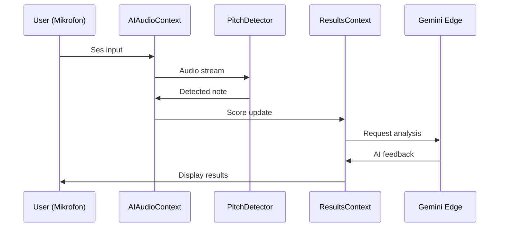

# Adım 3: Teknik Mimari Tasarımı

**Amaç:** AI müzik sisteminin teknik mimarisini tasarla.

---

## 3.1 Sistem Mimarisi

```
┌─────────────────────────────────────────────────────────────┐
│                    MÜZIK AI SİSTEMİ                        │
├─────────────────────────────────────────────────────────────┤
│  ┌──────────┐   ┌──────────┐   ┌───────────────┐           │
│  │ Mikrofon │ → │ Web Audio│ → │ Pitch Detection│          │
│  └──────────┘   └──────────┘   └───────────────┘           │
│                      │                │                     │
│                      ▼                ▼                     │
│              ┌────────────┐   ┌────────────────┐           │
│              │ Analyser   │   │ Note Comparator│           │
│              │ Node       │   │ (ML Model)     │           │
│              └────────────┘   └────────────────┘           │
│                      │                │                     │
│                      ▼                ▼                     │
│              ┌─────────────────────────────┐               │
│              │     AIAudioContext          │               │
│              │  (New Context Provider)     │               │
│              └─────────────────────────────┘               │
│                           │                                 │
│            ┌──────────────┼──────────────┐                 │
│            ▼              ▼              ▼                 │
│     ┌──────────┐   ┌──────────┐   ┌──────────┐            │
│     │Real-time │   │ Results  │   │ Gemini   │            │
│     │Feedback  │   │ Scoring  │   │ Analysis │            │
│     └──────────┘   └──────────┘   └──────────┘            │
└─────────────────────────────────────────────────────────────┘
```

---

## 3.2 Yeni Dosyalar

### Oluşturulacak Dosyalar

| Dosya | Konum | Açıklama |
|-------|-------|----------|
| `AIAudioContext.tsx` | contexts/ | AI ses işleme provider |
| `PitchDetector.ts` | utils/ | Pitch detection utility |
| `RhythmAnalyzer.ts` | utils/ | Ritim analiz utility |
| `useAIMusicAnalysis.ts` | hooks/ | Custom hook |
| `music-ai-proxy` | edge-functions/ | Gemini proxy |

---

## 3.3 AIAudioContext Interface

```typescript
interface AIAudioContextType {
  // Mikrofon kontrolü
  startListening: () => Promise<void>;
  stopListening: () => void;
  isListening: boolean;
  
  // Pitch detection
  currentPitch: number | null;
  currentNote: string | null;
  confidence: number;
  
  // Ritim
  detectedBeats: number[];
  tempo: number | null;
  
  // Analiz
  analyzePerformance: (target: Note[], played: Note[]) => Analysis;
}
```

---

## 3.4 Data Flow



---

## MENÜ

- **[C] Continue** → Adım 4'e geç (Uygulama)
- **[R] Revise** → Mimariyi düzenle
- **[D] Diagram** → Excalidraw diyagramı oluştur
